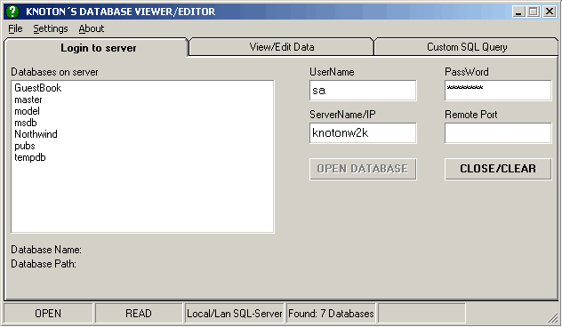



## Database Viewer/Editor ver 2\.4 Updated:Sept 28

### Description

Updated: Dec 02 2001, Ver 2.5 updates are functionality to associate MS Access (.mdb) databases with Database viewer/editor, and to

Maximaze the application.

View/Edit data on databases that can be MS SQL-Server local/lan or remote on internet, or a MS Access database. Get Data by clicking databases/tables/columns/views/stored procedures or perform custom SQL queries.

It shows ADO Programming and Some API.

In this version I have fixed some bugs from previous releases and improved the functionality.

Now you can view the "source" of all stored procedures and views in SQL-Server.

Thanks to all who came with feedback/suggestions in previous versions of this application.

The project is made with VB 6.0 Service Pack 5 and I used MDAC 2.5.

Please help me grow as a programmer and come with feedback/suggestions.
 
### More Info
 

             |
---                |---
**Submitted On**   |2001-12-03 17:20:56
**By**             |[Knoton](https://github.com/Planet-Source-Code/PSCIndex/blob/master/ByAuthor/knoton.md)
**Level**          |Advanced
**User Rating**    |5.0 (124 globes from 25 users)
**Compatibility**  |VB 6\.0
**Category**       |[Databases/ Data Access/ DAO/ ADO](https://github.com/Planet-Source-Code/PSCIndex/blob/master/ByCategory/databases-data-access-dao-ado__1-6.md)
**World**          |[Visual Basic](https://github.com/Planet-Source-Code/PSCIndex/blob/master/ByWorld/visual-basic.md)
**Archive File**   |[Database\_V3917412320\.zip](https://github.com/Planet-Source-Code/knoton-database-viewer-editor-ver-2-4-updated-sept-28__1-26963/archive/master.zip)

